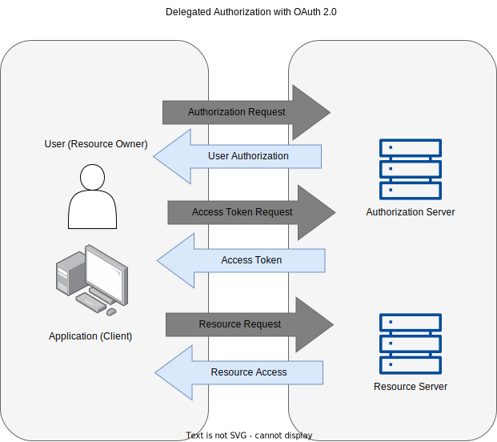
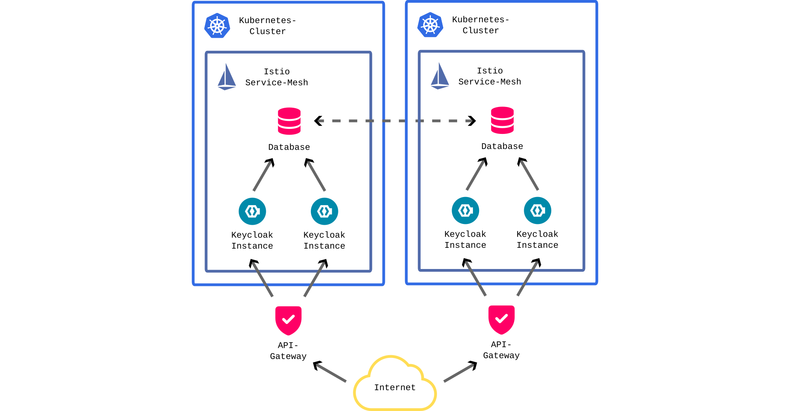
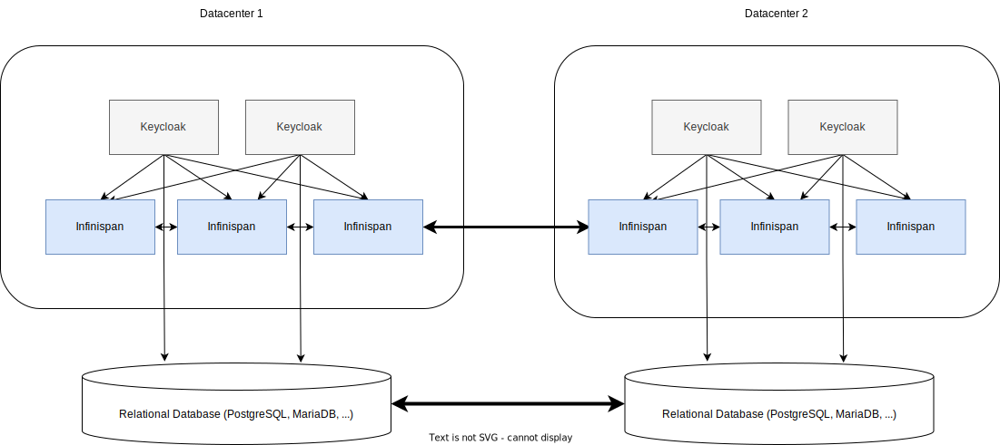
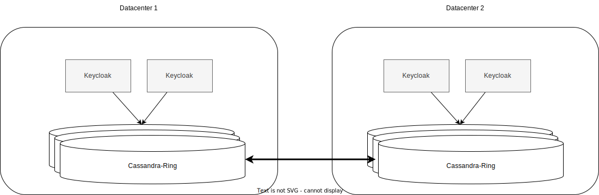
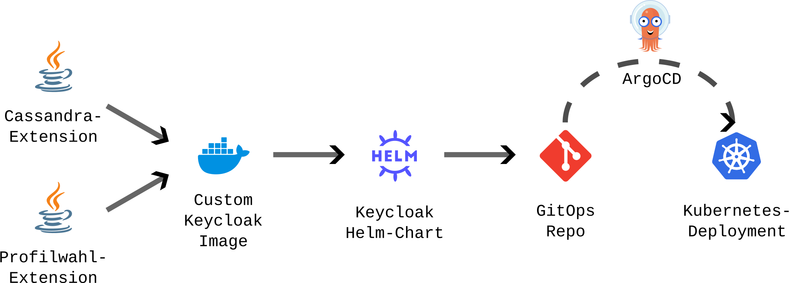

<!-- theme: default -->

<style>
@import url('https://fonts.cdnfonts.com/css/liberation-mono'); 

ul li {
  margin-bottom: 1.2em;
}
</style>

# Modernes und flexibles Identity- und Access-Management mit Keycloak

---
# Kurzvorstellung Stefan

- 32 Jahre alt
- DevOps-Engineer
- Fokus: Kubernetes, Infrastruktur
- Aktuell Teil eines Plattformteams einer großen Behörde

---
# Kurzvorstellung Dominik

- 35 Jahre alt
- Softwareentwickler / -architekt
- Fokus: Java, IAM, Kubernetes
- Aktuell Teil eines Plattformteams einer großen Behörde

---
# Einführung: Angebote aus der Cloud

- AWS Cognito
- Azure Active Directory B2C
- Google Cloud Identity Platform
- ForgeRock Cloud

---
Pro:

- top abgesichert
- ausfallsicher
- erprobt und weltweit im Einsatz
- Administrationaufwand: keine Gedanken um DB, Configs, etc.

Con:

- geringe Flexibilität für komplexe Erweiterungen:  
  Profile, Vertreterrollen, Vertrauensstufen kaum oder auch nur mit Aufwand möglich
- Datenschutz

---
# Keycloak

<!-- 5 Minuten bis "Einführung Keycloak in einer großen Bundesbehörde" -->
- Open Source IAM (Apache 2.0)
- AuthN und AuthZ
- Identity Brokering / Social Login
- User Federation
- Standard-Protokolle: OAuth/OIDC, SAML
- Kommerzieller Support durch RedHat möglich (RH-SSO)

---


---



---


---


---
# Einführung Keycloak in einer großen Bundesbehörde

<!-- 5 Minuten bis "Cassandra" -->
 - Es existiert bereits ein IAM (proprietär, historisch gewachsen)
 - Wunsch nach Modernisierung
 - Zielbild: Standardkonform, anpassbar an fachliche Anforderungen, zukunftssicher

---
# Herausforderungen: Organisatorisch

- Umfeld: Verwaltung  
  🠖 enger rechtlicher Rahmen, umfangreiche fachliche Anforderungen, etc.
- Wunsch nach Standardsystem ⚡ Bedarf an Sonderlocken
- Abhängigkeiten von Altsystemen zu wichtiger Geschäftslogik  
  🠖 Migration umfasst mehr als nur Wechsel IAM-System
- Verantwortung für Identity-Management auf 3 Teams aufgeteilt

---
# Folgerungen

- eine Menge Meetings :(
- Erweiterung von Keycloak mit eigenem Code
- Infrastructure as Code
  🠖 Nachvollziehbarkeit & Transparenz
- Self-Service zur Client-Verwaltung
  🠖 Beschleunigung & Eindeutigkeit

---

# Herausforderung: Infrastruktur



---
# Keycloak Systemarchitektur

<!-- 5 Minuten bis "Config as Code" -->



<!-- 
- Infinispan verhindert aktuell Zero Downtime Upgrades
- Infinispan-Querkommunikation (via JGroups) kann zu unerwarteten Performanceproblemen führen
- Infinispan-Discovery und Kommunikation problematisch bei Verwendung von Service-Meshes (Istio)
- Konfiguration aktuell in der Datenbank, Config-As-Code nur mit 3rd-Party-Tools (ConfigCLI) möglich
- Fokus auf relationale Datenbanken schränkt Lösungsraum ein
-->

---
# Keycloak-Extensions for the win!

- Was wäre, wenn wir kein Infinispan bräuchten?
- Können wir eigentlich eine Cassandra-Datenbank an Keycloak anbinden?

---


---

# Keycloak-Cassandra

<!-- Basiert auf Map-Storage -->
<!-- TODO: Weniger Text -->
- https://github.com/opdt/keycloak-cassandra-extension
- Wird intern seit einem Jahr genutzt und weiterentwickelt
- Hat erfolgreich Lasttests durchlaufen
- Macht auch Infinispan überflüssig
- Welche Storage-Areas verwendet werden sollen ist konfigurierbar (Mischung möglich)
- Contributions welcome!

---

# Vereinfachte Systemarchitektur



---
# Config as Code
<!-- 6 Minuten bis "Demo" -->

---
# Status Quo Keycloak

<!-- TODO: Weniger Text -->
- DB = Config-Speicher (für Realms, Clients, etc.)
- Keine Reproduzierbarkeit, Sicherung nur via DB-Backup
- 🛟 keycloak-config-cli to the rescue 🛟  
  = Tool zum Einspielen von YAML-Config via Admin-API in DB  
  🠖 Vollständig automatisierte Keycloak-Deployments
  🠖 Weiterentwicklung der Config mithilfe von Git möglich
  ⚠️ Keycloak-API unvollständig: irreparable Config in DB

---
# +++ NEU +++ File-Storage +++ NEU +++
 
- Ab Keycloak 21 neue „DB“: lokale YAML-Files
- Aktuell noch frühes Preview-Stadium (Format wird sich noch ändern)
- Zwischenschritt über DB entfällt komplett
- Config in Git 🠖 ConfigMap in Kubernetes 🠖 Mount in Keycloak-Pod

---
# Okay, es ist kompliziert

```
├── OCP
│   ├── clients
│   │   ├── account-console.yaml
│   │   ├── account.yaml
│   │   ├── admin-cli.yaml
│   │   ├── broker.yaml
│   │   ├── fapi.yaml
│   │   ├── ocp-api-client-public.yaml
│   │   ├── ocp-api-client.yaml
│   │   └── security-admin-console.yaml
│   ├── client-scopes
│   │   ├── acr.yaml
│   │   ├── address.yaml
│   │   ├── email.yaml
│   │   ├── microprofile-jwt.yaml
│   │   ├── offline_access.yaml
│   │   ├── phone.yaml
│   │   ├── profile.yaml
│   │   ├── role_list.yaml
│   │   ├── roles.yaml
│   │   └── web-origins.yaml
│   └── roles
│       ├── default-roles-ocp.yaml
│       ├── offline_access.yaml
│       ├── realm-management
│       │   ├── create-client.yaml
│       │   ├── impersonation.yaml
│       │   ├── manage-authorization.yaml
│       │   ├── manage-clients.yaml
│       │   ├── manage-events.yaml
│       │   ├── manage-identity-providers.yaml
│       │   ├── manage-realm.yaml
│       │   ├── manage-users.yaml
│       │   ├── query-clients.yaml
│       │   ├── query-groups.yaml
│       │   ├── query-realms.yaml
│       │   ├── query-users.yaml
│       │   ├── realm-admin.yaml
│       │   ├── view-authorization.yaml
│       │   ├── view-clients.yaml
│       │   ├── view-events.yaml
│       │   ├── view-identity-providers.yaml
│       │   ├── view-realm.yaml
│       │   └── view-users.yaml
│       └── uma_authorization.yaml
└── OCP.yaml
```

---
# Autsch, es ist noch komplizierter

```
schemaVersion: 1.0.Alpha1
name: OCP
enabled: true
sslRequired: NONE
displayName: OCP
displayNameHtml: <div class="kc-logo-text"><span> OCP </span></div>

accessCodeLifespan: 60
accessCodeLifespanLogin: 1800
accessCodeLifespanUserAction: 300
accessTokenLifespan: 60
accessTokenLifespanForImplicitFlow: 900
offlineSessionIdleTimeout: 2592000
offlineSessionMaxLifespan: 5184000
offlineSessionMaxLifespanEnabled: false
ssoSessionIdleTimeout: 1800
ssoSessionMaxLifespan: 36000

...
```

---
# „Hacks“

- Abstraktion der Defaults in Helm-Chart
- Aufteilen der Config auf mehrere K8s-Config-Maps
- Abbildung der Baumstruktur mit vielen Volume-Mounts
- Einbinden von Secrets via Template-Schritt
- Als Early Adopter geben wir kontinuierlich Feedback zur Weiterentwicklung

---

# Anpassung eines Authentication Flows
<!-- 10 Minuten bis "Deployment im Überblick" -->

- Authentication Flows beschreiben den Ablauf eines Authentifizierungsvorgangs
- Es gibt auch Flows, die z.B. nach Rückkehr von einem externen IDP einsetzen
- Flows sind DAGs deren Ergebnis entweder eine erfolgreiche Anmeldung oder ein Fehler ist
- SPI-Implementierungen ermöglichen komplexe Erweiterungen um Loginvorgänge an die eigenen Anforderungen anzupassen

---
# Demo: Custom Captcha

---
# Deployment im Überblick
<!-- 8 Minuten -->



---
# Keycloak ist unglaublich flexibel!

- UI: eigenes Theme
- Profilfunktionen: Login-Erweiterung
- Externe Identity-Provider: SAML-Hooks
- Sessionlaufzeiten basierend auf Vertrauensniveau: Session-Storage

---
# Fragen?